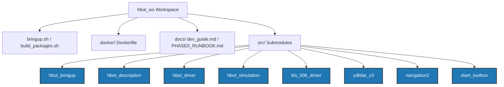

# Workspace Overview: HBOT AMR Platform

This document provides a comprehensive breakdown of the `hbot_ws` ROS 2 workspace. It outlines the architectural components, package roles, mechanical configuration of the robot, and launch pipeline logic.

---

## 🏗️ Repository Architecture

The workspace is organized as a main repository containing utility scripts, Docker build recipes, documentation, and a series of Git submodules located under the `src` folder.



---

## 📦 Package Directory & Roles

Under the `src/` directory, the following ROS 2 packages are configured as submodules:

### 1. [hbot_bringup](file:///home/huy/Documents/03.MyProjects/hbot_ws/src/hbot_bringup)
* **Role**: The central orchestration package.
* **Key Files**:
  * [hbot_bringup.launch.py](file:///home/huy/Documents/03.MyProjects/hbot_ws/src/hbot_bringup/launch/hbot_bringup.launch.py): The main entry launch file handling arguments for simulation/real hardware, mapping, navigation, and localization.
  * [base_bringup.launch.py](file:///home/huy/Documents/03.MyProjects/hbot_ws/src/hbot_bringup/launch/base_bringup.launch.py): Production Pi entry point (driver + web dashboard + EKF). `hbot_web`'s teleop `cmd_vel` is published on `cmd_vel_teleop` and passed through a dedicated `nav2_velocity_smoother` instance named `teleop_velocity_smoother` (own `lifecycle_manager_smoother`, reusing the `velocity_smoother` block from `nav2_params.yaml` via a `RewrittenYaml` key rewrite) onto `cmd_vel_teleop_smoothed`. `hbot_bringup.launch.py`'s on-demand Nav2 stack similarly smooths its output onto `cmd_vel_nav_smoothed` (via a `SetRemap` around the vendored `navigation_launch.py` include, so the `navigation2` submodule itself is never edited). A `twist_mux` node (config `config/twist_mux.yaml`, teleop priority 100 > nav priority 10) arbitrates the two into the single final `cmd_vel` the driver consumes — see [walkthrough.md](walkthrough.md#2026-08-20-fixed-nav2-not-accepting-goals--velocity_smoother-node-name-collision) and the twist_mux follow-up entry for why both smoothers can't just write to `cmd_vel` directly.
  * `config/`: Contains YAML parameters for navigation (`nav2_params.yaml`), SLAM (`slam_params.yaml`), and the serial driver (`yahboom_driver_params.yaml`). `nav2_params.yaml`'s `controller_server` uses the Regulated Pure Pursuit controller (`nav2_regulated_pure_pursuit_controller`) with a rectangular robot footprint (not `robot_radius`) and a tight inflation radius, tuned to fit through ~10cm-clearance corridors — see [walkthrough.md](walkthrough.md#2026-08-19-nav2-local-controller-swapped-to-rpp--narrow-corridor-costmap-tuning) for details.

### 2. [hbot_description](file:///home/huy/Documents/03.MyProjects/hbot_ws/src/hbot_description)
* **Role**: Defines the mechanical and physical properties of the robot.
* **Key Files**:
  * [hbot.urdf.xacro](file:///home/huy/Documents/03.MyProjects/hbot_ws/src/hbot_description/urdf/hbot.urdf.xacro): The primary parameterised Xacro file. On branch `feat/cad-model` it is the single source for two generated descriptions (via `cmake/generate_urdf.cmake`): `urdf/hbot.urdf` (real robot, TF frames only: `base_footprint`, `base_link`, `laser`, `imu_link`; loaded by `hbot_bringup`) and `urdf/hbot_sim.urdf` (`sim:=true`: + CAD meshes, collisions, wheels, caster from `hbot_body.xacro` and Gazebo plugins from `hbot.gazebo.xacro`; loaded by `hbot_simulation`). Measured dimensions come from the generated `urdf/cad_params.xacro`.
  * `models/*.stl` → [scripts/prepare_meshes.py](file:///home/huy/Documents/03.MyProjects/hbot_ws/src/hbot_description/scripts/prepare_meshes.py) → `meshes/*.stl` + `urdf/cad_params.xacro` (feat/cad-model; guide: [docs/cad_model.md](file:///home/huy/Documents/03.MyProjects/hbot_ws/src/hbot_description/docs/cad_model.md)).
  * `CMakeLists.txt`: Instructs the build process to automatically compile the Xacro into `hbot.urdf` and export the Gazebo-compatible `hbot.sdf`.

### 3. [hbot_driver](file:///home/huy/Documents/03.MyProjects/hbot_ws/src/hbot_driver)
* **Role**: High-level hardware interfacing (ported to C++; the Python node below is legacy).
* **Key Files**:
  * [hbot_driver_yahboom_node.cpp](file:///home/huy/Documents/03.MyProjects/hbot_ws/src/hbot_driver/src/hbot_driver_yahboom_node.cpp): Subscribes to `cmd_vel`, translates linear/angular velocity to per-wheel RPM commands over serial to the Yahboom Rosmaster board, and publishes odometry, battery status, and optional IMU telemetry. Includes a `cmd_vel` watchdog (`cmd_vel_timeout` param, default `0.5s`): a timer checks time-since-last-`cmd_vel` and zeroes the motors if it's exceeded, so the robot stops itself if the publisher (teleop client, Nav2, etc.) disconnects or the network drops instead of coasting on the last command forever.
  * [hbot_driver_yahboom.py](file:///home/huy/Documents/03.MyProjects/hbot_ws/src/hbot_driver/hbot_driver_yahboom/hbot_driver_yahboom.py): Legacy Python implementation of the same node, predating the C++ port.
  * `Rosmaster_Lib/`: Underlying python library for low-level serial communication with the Yahboom controller board (still used by `test/calibrate_pid.py`).

### 4. [hbot_simulation](file:///home/huy/Documents/03.MyProjects/hbot_ws/src/hbot_simulation)
* **Role**: Simulation environment.
* **Key Files**:
  * [hbot_house.launch.py](file:///home/huy/Documents/03.MyProjects/hbot_ws/src/hbot_simulation/launch/hbot_house.launch.py): Launches Gazebo, loads a virtual indoor environment (`hbot_house.world`), runs `robot_state_publisher`, and spawns the robot **from the `/robot_description` topic** (not a pre-baked `.sdf`) so the simulated body and the TF tree share one source of truth. Accepts a `headless` arg (gzserver only, no GUI). The simulated robot's frame tree and diff-drive geometry are kept in lock-step with the real robot — see [walkthrough.md](walkthrough.md#2026-08-27-simulation-parity--model-matches-the-real-urdf-mapping--nav2-run-headless).
* **Docs**: [docs/simulation_guide.md](../docs/simulation_guide.md) (reference: architecture, all `bringup.sh` args, troubleshooting) and [docs/sim_mapping_localization_guide.md](../docs/sim_mapping_localization_guide.md) (course: step-by-step mapping + localization lessons). Headless smoke scripts: `scripts/dev_sim_*.sh`.

### 5. Lidar drivers — selectable via `LIDAR_MODEL` env var
[hbot_bringup.launch.py](file:///home/huy/Documents/03.MyProjects/hbot_ws/src/hbot_bringup/launch/hbot_bringup.launch.py)'s
lidar `IncludeLaunchDescription` is picked at launch time by `LIDAR_MODEL`
(same `os.environ.get(...)` pattern as `CONTROLLER`; exported with a default
by [scripts/bringup.sh](file:///home/huy/Documents/03.MyProjects/hbot_ws/scripts/bringup.sh)), not a launch argument, since the physical sensor
attached to the robot doesn't change between launches of the same machine.
* **`LIDAR_MODEL=lds01`** (`hbot_bringup.launch.py`'s own internal fallback
  if `LIDAR_MODEL` is unset entirely — `scripts/ros_env.sh` overrides this
  with `ydlidar_x3` as the workspace default, see below): the LDS-01
  (Turtlebot3-compatible) unit, driven by the apt-installed
  `hls_lfcd_lds_driver` package (`port:=/dev/usbttl`) — not a package in
  this workspace.
* **[lds_006_driver](file:///home/huy/Documents/03.MyProjects/hbot_ws/src/lds_006_driver)**:
  submodule driver for the older LDS-006 unit (`src/lds006_laser_publisher.cpp`,
  publishes `sensor_msgs/LaserScan` on `/scan`); currently unused —
  `hbot_bringup.launch.py` has its include commented out in favor of LDS-01.
* **`LIDAR_MODEL=ydlidar_x3` (current default)**: the YDLidar X3 Pro,
  driven by `ydlidar_ros2_driver`
  (`launch/x3_ydlidar_launch.py`, params `params/ydlidar_x3.yaml`, port
  `/dev/usbttl`), nested together with its C++ SDK dependency
  (`YDLidar-SDK-master`) inside the
  [ydlidar_x3](file:///home/huy/Documents/03.MyProjects/hbot_ws/src/ydlidar_x3)
  submodule (`git@github.com:HbotVN/ydlidar-ros2-driver.git`, registered in
  `.gitmodules`). The SDK is a bare CMake project with no `package.xml` —
  it's meant to be built/installed standalone
  (`cmake && make && sudo make install`, not through colcon) so its
  `COLCON_IGNORE` keeps colcon from racing it against
  `ydlidar_ros2_driver`'s `find_package(ydlidar_sdk)`. See
  [docs/ydlidar_x3_lidar.md](../docs/ydlidar_x3_lidar.md) for the full
  setup guide, and
  [walkthrough.md](walkthrough.md#2026-08-24-ydlidar-x3-pro-added-alongside-lds-01-selectable-via-lidar_model)
  for the history (including the Humble launch-API fixes made to
  `x3_ydlidar_launch.py` and the `params_file` override bug).

### 6. [navigation2](file:///home/huy/Documents/03.MyProjects/hbot_ws/src/navigation2) & [slam_toolbox](file:///home/huy/Documents/03.MyProjects/hbot_ws/src/slam_toolbox)
* **Role**: Standard localization, mapping, and path planning components customized or referenced for this robot.

### 7. [hbot_web](file:///home/huy/Documents/03.MyProjects/hbot_ws/src/hbot_web) (not a submodule — lives directly in this repo)
* **Role**: Flask-SocketIO web dashboard — joystick teleop, telemetry (battery/odom/scan), map viewer with Nav2 pose-estimate/goal-setting tools, saved-map management (SQLite), and WiFi AP/STA control via `nmcli`.
* **Key Files**:
  * [web_node.py](file:///home/huy/Documents/03.MyProjects/hbot_ws/src/hbot_web/hbot_web/web_node.py): the ROS 2 node + Flask/SocketIO server in one process. Publishes teleop `cmd_vel`, `initialpose`, and `goal_pose`; subscribes `odom`, `battery_voltage`, `scan`, `map`, `amcl_pose`, and Nav2's global `plan` (re-emitted to the browser as `plan_status` for the path overlay). `ROSLaunchManager` switches the robot between mapping/navigation/idle by shelling out to the scripts below.
  * `scripts/start_mapping.sh` / `start_navigation.sh`: thin wrappers around `ros2 launch hbot_bringup hbot_bringup.launch.py ...` that `ROSLaunchManager` execs (via `subprocess.Popen`, no `env=` override — full inheritance), each logging to its own timestamped file under `~/hbot_ws/log/`. Normally inherit an already-sourced ROS environment from `hbot_web_node` (started via [web_bringup.sh](file:///home/huy/Documents/03.MyProjects/hbot_ws/scripts/web_bringup.sh)), detected via `LIDAR_MODEL` as a marker; fall back to explicitly sourcing [scripts/ros_env.sh](file:///home/huy/Documents/03.MyProjects/hbot_ws/scripts/ros_env.sh) via `$HBOT_WS` otherwise, erroring loudly if that's unset too rather than silently launching with wrong defaults — see [walkthrough.md](walkthrough.md#2026-08-25-follow-up-made-start_mappingshstart_navigationsh-self-sufficient).
  * [templates/index.html](file:///home/huy/Documents/03.MyProjects/hbot_ws/src/hbot_web/hbot_web/templates/index.html) + [static/js/main.js](file:///home/huy/Documents/03.MyProjects/hbot_ws/src/hbot_web/hbot_web/static/js/main.js): canvas joystick, map canvas (with a live Nav2 global-path overlay and "2D Pose Estimate"/"Set Goal" click-drag tools, mutually exclusive, "Set Goal" gated to navigation mode), Socket.IO bindings, WiFi modals.
  * `hbot_maps.db` (SQLite, under `MAPS_DIR`): saved-map registry (name, YAML/PGM paths, active flag).

---

## 🤖 Robot Specifications (Mechanical & Kinematics)

From [hbot.urdf.xacro](file:///home/huy/Documents/03.MyProjects/hbot_ws/src/hbot_description/urdf/hbot.urdf.xacro) and [yahboom_driver_params.yaml](file:///home/huy/Documents/03.MyProjects/hbot_ws/src/hbot_bringup/config/yahboom_driver_params.yaml):

* **Type**: Differential Drive Robot
* **Dimensions**: Length: `0.17m`, Width: `0.14m`, Height: `~0.12m` (sim
  collision box uses `0.11m` so its top clears the lidar scan plane).
* **Frame tree** (identical in sim and on hardware — the sim xacro mirrors
  [`hbot_bringup/config/hbot.urdf`](file:///home/huy/Documents/03.MyProjects/hbot_ws/src/hbot_bringup/config/hbot.urdf),
  the URDF the Pi actually loads): `base_footprint` == `base_link` (identity
  joint); `laser` at `xyz="0.08 0 0.14" rpy="0 0 0"`; `imu_link` at the base
  origin.
* **Wheels**:
  * **Diameter**: `0.065m` (radius `0.0325m`).
  * **Track Width / Separation**: `0.20m` — matches the driver's `wheel_track`
    in `yahboom_driver_params.yaml` (the xacro previously computed `0.17m`
    from `base_width + 2 * wheel_ygap` and had drifted).
  * **Encoder Resolution**: `11` PPR, Gear Ratio: `56:1`. Total encoder ticks per rotation = `11 * 56 * 4 = 2464` ticks.
* **Lidar Sensor**:
  * **Mounting**: `0.08m` forward of and `0.14m` above the base origin
    (`base_link`/`base_footprint`), **no yaw** (`rpy="0 0 0"`). Matches the
    real robot's URDF; the old sim value (`0 0 0.075`, yaw `π`) has been
    dropped. In sim, Gazebo's ray sensor models the YDLidar X3
    (`0.12–12 m`, `10 Hz`, 360°); see
    [walkthrough.md](walkthrough.md#2026-08-27-simulation-parity--model-matches-the-real-urdf-mapping--nav2-run-headless).

---

## 🚀 Operations & Orchestration Pipeline

### 🔄 Build Script (`build_packages.sh`)
Forces the system's python executable (`/usr/bin/python3`) and environment configs to avoid conflicts with virtual/conda environment python installations when invoking `colcon build`.

### 🚀 Bringup Script (`bringup.sh`)
Wraps the `ros2 launch hbot_bringup hbot_bringup.launch.py` command. Environment setup (`ROS_DOMAIN_ID=9`, `CONTROLLER=yahboom`, `LIDAR_MODEL=ydlidar_x3`, `PATH`/`AMENT_PREFIX_PATH`/`PYTHONPATH`, sourcing ROS + the workspace `install/setup.bash`) lives in shared [scripts/ros_env.sh](file:///home/huy/Documents/03.MyProjects/hbot_ws/scripts/ros_env.sh), sourced via `$HBOT_WS` (exported here) — [scripts/web_bringup.sh](file:///home/huy/Documents/03.MyProjects/hbot_ws/scripts/web_bringup.sh) (production Pi entry point, wraps `base_bringup.launch.py`) sources the same file, so the two can't drift out of sync on env vars/defaults the way they once did.

### 🗺️ Operational Modes matrix

```
                 +-------------------+
                 |    bringup.sh     |
                 +---------+---------+
                           |
            +--------------+--------------+
            |                             |
  [simulation_mode:=True]       [simulation_mode:=False]
            |                             |
     (Gazebo simulation)        (Real Yahboom HW & LiDAR)
            |                             |
      +-----+-----+                 +-----+-----+
      |           |                 |           |
  [slam:=T]   [slam:=F]         [slam:=T]   [slam:=F]
      |           |                 |           |
  SLAM/Map    Nav2 Map-based    SLAM/Map    Nav2 Map-based
  Building    Localization      Building    Localization
```

Both `slam:=True` branches run **Cartographer** (`carto_mapping.lua`,
tracking `base_footprint`, publishing `map -> odom`), not slam_toolbox — the
slam_toolbox include in `hbot_bringup.launch.py` is commented out.

`simulation_mode` differences beyond Gazebo-vs-hardware:

* **Headless**: `headless:=True` forwards to `hbot_house.launch.py` to run
  gzserver without the GUI (default `False`).
* **Odometry**: Gazebo's diff-drive plugin publishes `odom -> base_footprint`
  and `/odom` directly. On hardware the driver + `robot_localization` EKF
  (in `base_bringup.launch.py`) do this; the EKF is **not** run in sim.
* **`cmd_vel`**: on hardware Nav2's smoothed output is remapped to
  `cmd_vel_nav_smoothed` and a `twist_mux` (in `base_bringup.launch.py`)
  arbitrates teleop vs. Nav2 onto the final `cmd_vel`. Sim has no
  `base_bringup`/`twist_mux`, so `hbot_bringup.launch.py`'s `_sim` branch
  skips that remap and Nav2's `velocity_smoother` publishes `cmd_vel`
  straight to the Gazebo diff-drive plugin. See
  [walkthrough.md](walkthrough.md#2026-08-27-simulation-parity--model-matches-the-real-urdf-mapping--nav2-run-headless).
